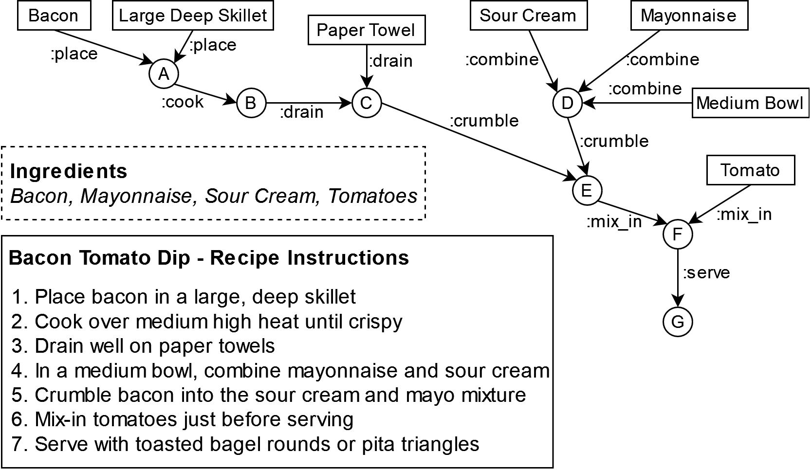

My submission for the research track at the 2022 [International Semantic Web Conference](https://iswc2022.semanticweb.org/),
 titled "EaT-PIM: Substituting Entities in Procedural Instructions using Flow Graphs and Embeddings", was accepted.
 This paper is based on the work that I conducted during my internship at Bosch last year, and consists of methods to
 parse natural language instructions into flow graphs as well as a novel embedding method
 which we can use to then identify plausible ingredient substitions.

 
The repo of the code used in this work, as well as a copy of the camera ready version of our paper,
is available [here](https://github.com/boschresearch/EaT-PIM).

At ISWC 2022, I also had a number of additional papers that I was involved with accepted.

First, at the [Wikidata Workshop](https://wikidataworkshop.github.io/2022/) I presented our work on 
[Rule-Based Link Prediction over Event-Related Causal Knowledge in Wikidata](https://wikidataworkshop.github.io/2022/papers/Wikidata_Workshop_2022_paper_9715.pdf).
In this work, we curated a dataset of events with causal relations in [Wikidata](https://www.wikidata.org), and 
investigated the performance of some rule-based link prediction methods over this data.

At the [DL4KG](https://alammehwish.github.io/dl4kg2022/) workshop, a fellow IBM intern Aamod shared our investigations on
[Knowledge Graph Embeddings for Causal Relation Prediction](https://alammehwish.github.io/dl4kg2022/papers/paper-8.pdf), in which
we investigate the performance of various SotA link prediction models over another dataset of Wikidata events
and their causal relations. 

Lastly, I also contributed to some work in an in-use track submission surrounding IBM's 
Knowledge-Based News Event Analysis Toolkit. 
  