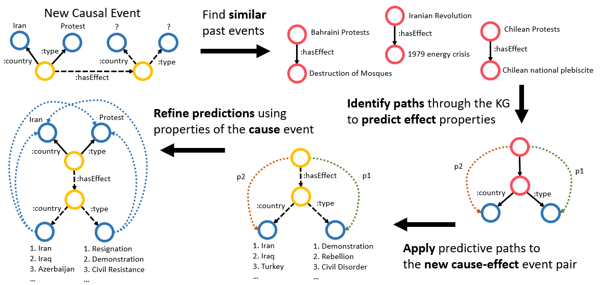

I presented my paper, titled "Event Prediction using Case-Based Reasoning over Knowledge Graphs",
 in the Semantics and Knowledge research track at [The Web Conference](https://www2023.thewebconf.org/) 2023.
This publication is based off of my 2022 externship work with IBM Research, focusing on
methods to leverage a knowledge graph of events curated from [Wikidata](https://www.wikidata.org/wiki/Wikidata:Main_Page)
to perform event prediction -- e.g., if a new event occurs, like a Protest in Iran, can we predict
what its effects will be? We frame the problem of event prediction as a 2-hop link prediction problem,
where we aim to predict the properties of a yet-unseen effect event starting from input properties of a
causal event.

 
 The main idea of this work is to leverage case-based reasoning (CBR) to perform predictions. 
 In short, CBR aims to solve new problems by looking to solution to similar cases that occurred in the past.
 Applied to event prediction, our model, EvCBR, searches for cases of similiar cause-effect event pairs that
 are present in the KG to perform predictions about the effect of a new causal event.
 EvCBR utilizes simple statistical measures and on-the-fly rule-learning, enabling inherent explainability
 as well as supporting inductive prediction for previously unseen entities. 
 
The repo of the code used in this work, as well as a copy of the camera ready version of our paper,
is available [here](https://github.com/solashirai/WWW-EvCBR/).
